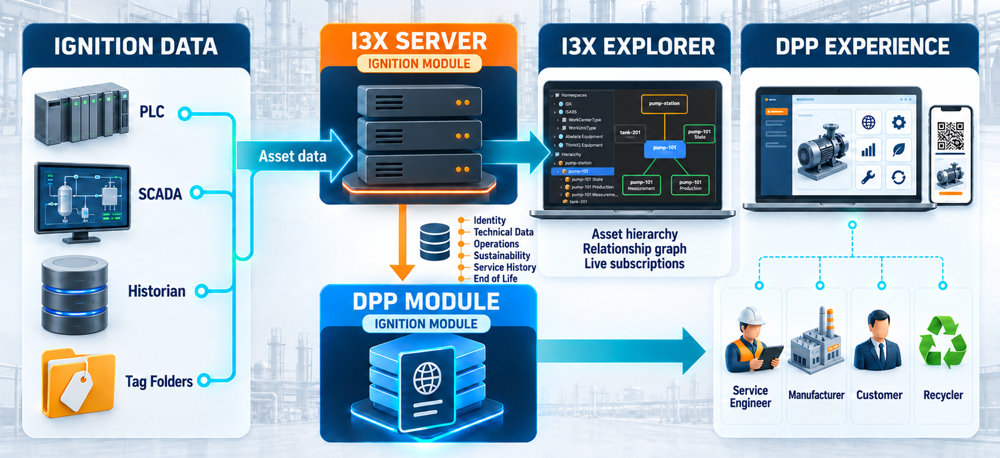
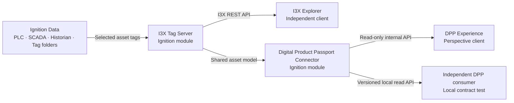

# Ignition I3X + Digital Product Passport POC

This repository demonstrates a local proof of concept that turns selected
Ignition tags into a shared I3X asset model and then presents the same assets as
Digital Product Passports (DPPs).

> **POC scope:** Run this project only on an isolated Ignition 8.3 test Gateway
> through `localhost`. It has not been prepared for a LAN, the public internet,
> or production use.





## Concept

The POC keeps the integration in separate layers:

1. **Ignition data** supplies PLC, SCADA, historian, and tag-folder values.
2. **I3X Tag Server** is an Ignition Gateway module. It maps selected scalar
   tags into an I3X hierarchy with object relationships, live values, quality,
   timestamps, short in-memory history, and polling subscriptions.
3. **I3X Explorer** is an independent client application. It connects through
   the I3X REST API and proves that another client can browse the hierarchy,
   inspect relationships, and read values without knowing the original
   Ignition tag layout.
4. **Digital Product Passport Connector** is a second Ignition Gateway module.
   It reads the I3X asset model and projects product identity, technical data,
   operational data, documents, provenance, and passport metadata.
5. **DPP Experience** is a read-only Perspective application for selecting an
   asset, reviewing its passport, opening its permitted document, and using its
   direct link or QR code.

The **I3X Tag Server** and **Digital Product Passport Connector** are the two
Ignition modules. **I3X Explorer** is a client of the I3X module, not another
Gateway module. The modules are built, signed, installed, and upgraded
independently while sharing the same asset model.

## POC components

| Component | Type | Current POC version | Purpose |
|---|---|---:|---|
| I3X Tag Server | Ignition Gateway module | `0.1.48-SNAPSHOT` | Exposes selected Ignition tags as an I3X asset graph |
| I3X Configurator | Perspective project | `0.4.2` | Selects tag folders, validates mappings, and activates the I3X model |
| I3X Explorer | Independent Perspective client | `1.0.0` reference | Browses I3X objects, relationships, live values, history, and subscriptions |
| Digital Product Passport Connector | Ignition Gateway module | `0.12.0-SNAPSHOT` | Builds read-only DPP views from I3X assets |
| DPP Experience | Perspective project | `0.12.0` | Presents the product passport to a user |
| Independent DPP consumer | Local client and frozen contract package | `0.3.0-draft` | Verifies the versioned read API without using the DPP UI |

## Plant 1 demo data

Use the supplied **`Plant 1 tags.json`** Ignition tag export with this project.
It is the sample source for the `Plant1` hierarchy used by the I3X
Configurator, I3X Explorer, DPP Connector, and DPP Experience.

Import it only into a dedicated test tag provider. Back up the Gateway and
export any existing tags first. If a `Plant1` folder already exists, review
Ignition's collision preview carefully before merging or replacing anything.
The sample includes illustrative identity and technical values; its bundled
datasheets are fictional POC documents.

The current full Plant 1 test model contains 561 scalar tags and 24 document
records. The I3X module supports at most 1,000 selected scalar mappings in this
POC. Folder objects do not count toward that limit.

## Local setup

1. Use an isolated Ignition 8.3 test Gateway and take a Gateway backup.
2. Import **`Plant 1 tags.json`** into a dedicated test tag provider.
3. Install the signed **I3X Tag Server** module.
4. Import the matching `I3X_DPP_POC` Perspective project.
5. In **Manage Asset Tags**, select the imported `Plant1` folder, choose
   **Import Folder**, review the staged mappings, then run **Apply Mappings**,
   **Validate**, and **Save & Activate**.
6. Import the I3X Explorer project, register the local I3X API address, and
   confirm that the Plant 1 hierarchy and relationships are visible.
7. Install the signed **Digital Product Passport Connector** module.
8. Import the matching `Ignition_DPP_POC` Perspective project and open the DPP
   Experience.
9. Keep all interoperability checks on the same computer through `localhost`.

## Local addresses

| Experience | Address |
|---|---|
| I3X Configurator | `http://localhost:8088/data/perspective/client/I3X_DPP_POC` |
| I3X API | `http://localhost:8088/data/com.gopal.ignition.i3xdpp/v1` |
| I3X Explorer | `http://localhost:8088/data/perspective/client/i3X_Application` |
| DPP Experience | `http://localhost:8088/data/perspective/client/Ignition_DPP_POC` |
| Versioned DPP read API | `http://localhost:8088/data/com.gopal.ignition.dpp/external/v1` |

The external DPP read API requires an approved local Gateway session or the
protected localhost headless credential. Never place the credential in a URL,
source file, screenshot, issue, or Git commit.

## Demonstrated POC flow

```text
Plant 1 tags.json
        |
        v
Ignition tag provider
        |
        v
I3X Tag Server module -----> I3X Explorer client
        |
        v
Digital Product Passport Connector module
        |                         |
        v                         v
DPP Perspective experience   Independent local DPP client
```

The current local acceptance milestone demonstrates:

- discovery of 24 Plant 1 assets in the trusted DPP viewer;
- a frozen, versioned third-party read contract for **AU 1** and **Pump 1**;
- four technical values and one product-bound PDF for each accepted product;
- schema-valid responses for both products;
- denial of unknown products and cross-product document requests;
- denial of anonymous and invalid-credential access; and
- a successful read by an independent same-computer client.

The external contract intentionally exposes only AU 1 and Pump 1. That is a
POC access-policy choice, not a Plant 1 limitation in the software design.
Other assets or plants can be added after their tags are mapped in I3X, their
identity is complete, and their products and documents are explicitly enrolled
in the DPP policy.

## Data responsibilities

| Source | Responsibility in the POC |
|---|---|
| Ignition tags | Operational values and the demo asset hierarchy |
| I3X model | Stable asset objects, relationships, live values, quality, timestamps, and history |
| DPP Connector | Product projection, passport identifiers, document policy, provenance, and read contract |
| Client applications | Display and independent verification of published read data |

The DPP module is read-only. It does not write back to Ignition tags or edit the
I3X configuration.

## Security boundary

- The POC is limited to loopback access on the Gateway computer.
- The I3X REST surface retains its test-only open-access design.
- DPP browser and headless reads are protected and restricted to explicitly
  enrolled products and documents.
- Document access uses an allowlist; arbitrary filesystem paths and uploads are
  not supported.
- Credentials and signing material must stay outside this repository.
- The signed module artifacts are POC builds and are not a production security
  or compliance certification.

## Known limitations

- This project does not claim complete I3X, Asset Administration Shell,
  Catena-X, EN 18223, or product-specific EU DPP conformance.
- The sample identities, specifications, and PDFs are illustrative and have not
  been validated by a manufacturer or certification authority.
- I3X history and subscriptions are memory-backed and reset when the module
  restarts.
- I3X subscriptions use polling in this POC; streaming tag writes are outside
  the current scope.
- Product enrollment and document binding are configuration steps rather than a
  finished administrator UI.
- Production work would require managed identities, HTTPS, role design, audit
  logging, persistent data, performance testing, standards validation, and an
  approved deployment model.

## POC roadmap

### Completed

- Separate signed I3X and DPP Ignition modules
- Plant 1 tag mapping and shared asset hierarchy
- I3X Explorer connection to the server
- Read-only DPP Perspective experience
- Product identity, technical data, operational data, provenance, and PDFs
- Local browser-session and headless-client access paths
- Two-product access policy and cross-product denial
- Independent consumer acceptance against a frozen contract package

### Next development milestones

1. Move product enrollment, document bindings, and access rules into a managed
   Gateway configuration interface.
2. Add a second test plant or provider to prove that the mapping is independent
   of the `Plant1` folder name.
3. Define the target standards profile and close the documented semantic gaps.
4. Add production-grade identity, authorization, HTTPS, audit, persistence, and
   capacity testing before any non-local deployment is considered.

## Purpose of this repository

This POC answers one practical question: **Can existing Ignition data be exposed
once as a reusable I3X asset model and then consumed both by an independent I3X
client and by a controlled Digital Product Passport experience?**

The local acceptance results show that the architecture works for the supplied
Plant 1 demonstration data. The remaining work is productization and standards
alignment, not proof of the basic integration path.
